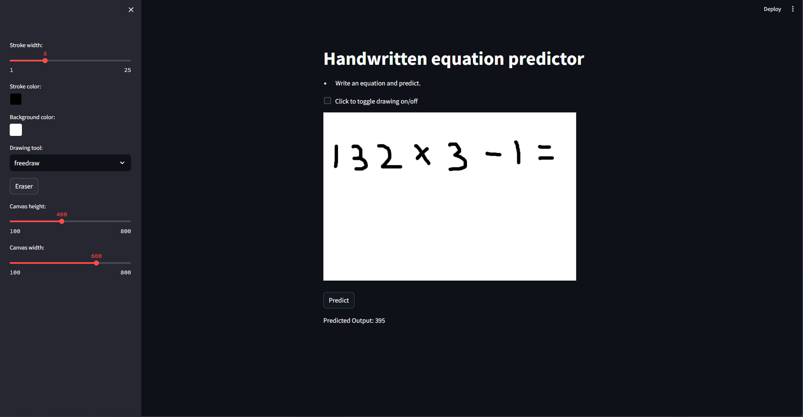

# Real Time hand written equation recognizing calculator

## Description
This project uses a Regularized CNN built using pytorch and trained on https://www.kaggle.com/datasets/clarencezhao/handwritten-math-symbol-dataset?select=train dataset so that it can segment, recognize and parse equations written on streamlit canvas.

## Features
- Multidigit recognitions
- Equation parser using stack

---

## Table of Contents
- [Installation](#installation)
- [Usage](#usage)
- [How the model was trained](#Training)
- [Future Work and Shortcomings](#future-work-and-shortcomings)

---

## Installation

### Prerequisites
- Python 3.x
- python libraries listed in requirements.txt
- **Options** CUDA 11.8 was used to train this on a RTX 3060 GPU otherwise pytorch would not detect the GPU

### Steps to Install
1. Clone the repository:
    ```bash
    git clone https://github.com/AnshulPatil29/7_Real-Time-Hand-Written-Recognizer-for-Calculator.git
    cd 7_Real-Time-Hand-Written-Recognizer-for-Calculator
    ```
2. Install the required dependencies:
    ```bash
    pip install -r requirements.txt
    ```
> Side note: The Ignore folder contains the example image in this readme, that can be deleted.
---

## Usage

### Running the Model
Run the app file
```bash
python app.py
```
It will give an output command similar to this
```bash
streamlit run ..path_to_folder\7_Real-Time-Hand-Written-Recognizer-for-Calculator\app.py
```
**Run that command, not the one shown above**  
This should open the app on your default browser 

---

### Example output



## Training

The dataset was augmented to create a total of 10,000 images. This augmentation was necessary because the images fed into the model after segmentation differed from the original training data. The following process was followed to generate the augmented dataset:

1. Random equations were generated.
2. Corresponding images were randomly sampled and concatenated.
3. These images were then segmented and stored, resulting in a dataset of around 10,000 images.

Note that the **division** and **equal-to** symbols were excluded from the dataset because the MSER (Maximally Stable Extremal Regions) segmentation technique failed to properly segment these symbols.

A **regularized CNN model** was trained for 10 epochs to prevent overfitting, which was a challenge faced by the previously used simple CNN model. 

### Results:
- The model achieved **93% training accuracy**.
- The model performed with **100% accuracy** on the validation dataset. However, this high accuracy is likely a byproduct of the test data choice, which included easy-to-recognize symbols, and the exclusion of troublesome symbols.
- Subjective testing revealed that the model worked best when digits had **clear vertical boundaries** between them.

The exclusion of the division and equal-to symbols, along with other specific preprocessing techniques, contributed to these results.

## future-work-and-shortcomings
### shortcomings
As mentioned in training, this model cannot predict division symbol, decimal symbol and equal to symbol. A fix has been applied for = symbol though, since the segmentation process yeilds 2 horizontal lines which are predicted as - and - by the model, if 2 - occur at end of the equation, it is assumed to be an =
The decimal was excluded purely by accident as the random equation generator solely generated integers. 
The model also requires some preprocessing to work on equations written on paper to deal with occlusion and gradients created by shadows. This can be dealt with by using adaptive histogram equalization and then using the minima of the histogram to threshold.
### future work
* add support for decimal symbol
* add option to upload image of equation written on plain paper
* handle negative digits during parsing
